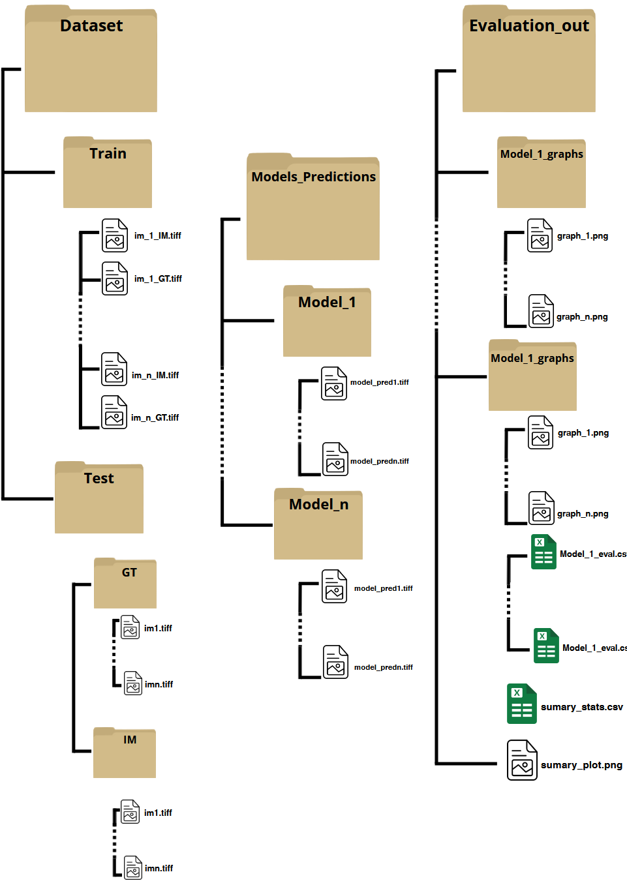

## Geometric and Topological Regularization for Bioimage Segmentation

This project is detailed in the following [paper](https://)

## File structure

The implementations and results are based/generated in the following file structure:



## Installation

Before starting, we recommend [creating a new conda environment](https://docs.conda.io/projects/conda/en/latest/user-guide/tasks/manage-environments.html#creating-an-environment-with-commands) or a [virtual environment](https://docs.python.org/3/library/venv.html) with **Python 3.10+**.

```bash
conda create -y -n topo_reg -c conda-forge python=3.11
conda activate topo_reg
```

This project is implemented within our [Im2Im Transformation](https://github.com/MMV-Lab/mmv_im2im/tree/main) framework. To install it, follow the instructions in the corresponding repository:

```bash
git clone https://github.com/MMV-Lab/mmv_im2im.git
cd mmv_im2im
pip install -e .[all]
```

Run 

```bash
pip install -r requirements.txt
``` 

## Regularizator Implementation

If you want to access the implementation of the regularizers for improvements or adaptation to different base loss functions or architectures, you can find the code within the [Im2Im Transformation](https://github.com/MMV-Lab/mmv_im2im/tree/main) project in the [utils folder](https://github.com/MMV-Lab/mmv_im2im/tree/main/mmv_im2im/utils) folder.

With the project installed, you can now train and run inference with the models.

## Trainig

For training, use the provided [YAML templates](docs/yaml_configurations). These files contain clear descriptions of the parameters and training options. Simply set your values, save your configuration, and run:

`run_im2im --config /path/to/your_train_config.yaml`

## Inference

We provide an [inference](inference.ipynb) Jupyter notebook to facilitate predictions. It works whether you want to make a prediction with your trained model or manage cases where you have multiple trained versions of the same model and want to run inference over the same dataset.

To use it, run Jupyter Lab, define your model in the provided [YAML templates](docs/yaml_configurations), and follow the instructions in the notebook. 

If you need to avoid the Jupyter Notebook execution we provide a full cli version executable trought:

`python core/inference_cli.py --yaml_path /your/path/ --images_folder /your/path/ --models_folder /your/path/ --multi_output_dir /your/path/  --weight_option last --pipeline_mode multi `

Where the inputs are the same required in the Jupyter notebook


For more detailed info related to training and inference, please refer to the documentation in our [Im2Im Transformation](https://github.com/MMV-Lab/mmv_im2im/tree/main) repo.

## Evaluation

We provide a [model evaluation](model_evaluation.ipynb) Jupyter notebook that allows you to extract information about model predictions and compare multiple training runs for a single model.


If you need to avoid the Jupyter Notebook execution we provide a full cli version executable for each step trought:

`python core/csv_metric_generation.py --gt-path /your/path/ --predictions-path /your/path/ `

`python core/summary_generation.py --csv-path /your/path/`

`python core/single_model_plots_generation.py --csv-path /your/path/`

Where the inputs are the same required in the Jupyter notebook

## Topological Regularizators availables

The training objective $\mathscr{L}_{total}$ is a weighted sum of a base segmentation loss and the desired regularization terms:

$\mathscr{L}_{total}=\mathscr{L}_{base}(P,Y)+\sum_{r\in Reg}\lambda_r\cdot\omega(e)_r\cdot\mathscr{L}_{r}(P,Y)$


<b>Base Loss Function</b>  $\mathscr{L}_{base}(P, Y)$

<b>ELBO</b> (In the case the Probabilistic U-Net)

<b>GDL</b> (In the case the Attention U-Net)

<b>Regularizator terms</b>  $\mathscr{L}_{r}(P, Y)$

($\mathscr{L}_{\mathscr{FD}}$) Fractal dimension 

($\mathscr{L}_{cc}$) Connectivity Coherence Loss

($\mathscr{L}_{\mathscr{WHR}}$) Weighted Hausdorff Regularization

($\mathscr{L}_{tc}$) Topological Complexity / Persistence Diagrams

($\mathscr{L}_{hom}$) Persistence Images

($\mathscr{L}_{TI}$) Topological restricted loss proposed by [TopoXLab](https://github.com/TopoXLab/TopoInteraction)

## Some results of the use of our regularizator terms 

